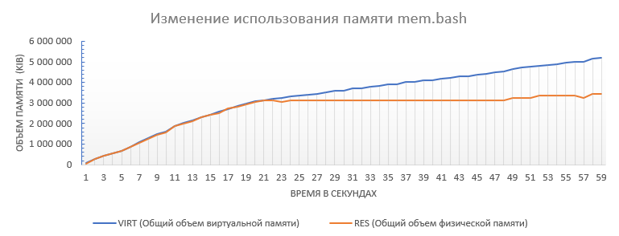
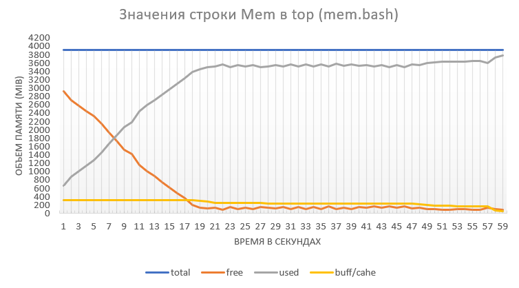
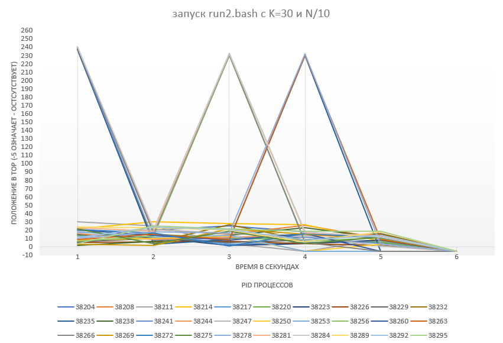

# Конфигурация операционной системы

### •	Общий объем оперативной памяти: 4010504 KiB

### •	Объем раздела подкачки: 2744316 KiB

### •	Размер страницы виртуальной памяти: 4096 B

### •	Объем свободной физической памяти в ненагруженной системе: 3079012 KiB

### •	Объем свободного пространства в разделе подкачки в ненагруженной системе: 2744316 KiB

# Эксперимент 1:

## Этап 1:

В скрипте mem.bash я добавлял по 10 элементов в массив, делая каждую секунду замер нужных величин с помощью следящего скрипта. Скрипт mem.bash работал 60 секунд до остановки операционной системой. 

### Графики наблюдаемых значений:

#### - график показателей mem.bash

#### - график показателей строки Mem в top

#### - график показателей строки Swap в top

Как видно из графика показателей mem.bash, примерно на 20-22 секунде объем используемой физической памяти приближается к 3’000’000 Kib, что практически равно “Объему свободной физической памяти в ненагруженной системе”. В это же время на графике “Mem” показатель “used” достигает порогового значения, а на графике “Swap” показатель “used” наоборот начинает резко расти. Можно сделать вывод о том, что ОС начинает использовать раздел подкачки, из-за полного заполнения RAM. Причем, так как объем использования виртуальной памяти растет и у самого процесса mem.bash, ОС помещает в раздел подкачки также страницы памяти, которые использует сам membash.

ОС убивает процесс mem.bash, когда разница между используемой виртуальной и физической памятью (иными словами, размер используемой памяти в разделе подкачки) достигает примерно 2’000’000 KiB, что говорит о приближении к другому граничному значению “Объему свободного пространства в разделе подкачки в ненагруженной системе”. Об этом также свидетельствует показатель “used” на графике “Swap”, который достигает своего порогового значения в виде показателя “total” на графике. Можно сделать вывод о том, что процесс запросил расширение адресного пространства, которое невозможно в пределах имеющейся объема даже с разделом подкачки, вследствие чего ОС остановила процесс. 

#### - график всех процессов, которые были среди 5 верхних в top

Во время выполнения в топ 5, кроме mem.bash оказывались только системные процессы. И единственным процессом, который смещал mem.bash с 1 места 
был kswapd0. Этот процесс смещал mem.bash (особенно часто под конец выполнения mem.bash), так как RAM было слишком заполнено, и ОС нужно было освободить ее за счет раздела подкачки, а kswapd0 - процесс, отвечающий за обмен страницами памяти между RAM и разделом подкачки.

### Последние 2 записи о работе скрипта в системном журнале:

1) oom-kill:constraint=CONSTRAINT_NONE,nodemask=(null),cpuset=/,mems_allowed=0,global_oom,task_memcg=/user.slice/user-1000.slice/user@1000.service/app.slice/app-org.gnome.Terminal.slice/vte-spawn-ab4e76ce-e2bb-4433-bbc3-33a3fd30e04e.scope,task=mem.bash,pid=10520,uid=1000

2) [ 6730.543099] Out of memory: Killed process 10520 (mem.bash) total-vm:5252484kB, anon-rss:3495552kB, file-rss:0kB, shmem-rss:0kB, UID:1000 pgtables:10300kB oom_score_adj:0

#### Последняя запись в report.log:

“Current size of array is 66000000”. 

## Этап 2:

После одновременного запуска mem.bash и mem2.bash, первым запросил расширение адресного пространства,
которое невозможно в пределах имеющейся, процесс mem.bash. Удалось собрать следующие значения

### Графики наблюдаемых значений:

#### - график показателей mem.bash и mem2.bash

#### - график показателей строки Mem в top

#### - график показателей строки Swap в top

Из графика "показателей mem.bash и mem2.bash" видно, что все происходит так же, как и на 1 этапе эксперимента, только в 2 раза быстрее: физическая память заканчивается не на ~20 секунде, а на ~10, когда каждый процесс взял по ~1'500'000 Kib (на 1 же этапе она закончилась при отметке ~3'000'000 Kib). Идентичность поведения ОС можно также увидеть, если сравнить графики строк Mem и Swap на этом этапе с этими же графиками с 1 этапа, по вертикальной оси объема памяти идентичные показатели, только скорость изменений с течением времени отличается в 2 раза. К 29 секунде, когда 2 процесса взяли на пару 2'500'000 * 2 = 5'000'000 Kib виртуальной памяти, значит 2'000'000 Kib из раздела подкачи (как и на 1 этапе), ОС убивает процесс mem.bash. На графиках Mem и Swap сразу виден резкий спад используемой памяти, и следующий прямо за ним опять стремительный рост: из графика mem2.bash видно, что второй процесс начал потреблять память первого процесса. Затем аналогично первому этапу, система убивает mem2.bash, когда показатель "used" на графике "Swap" достигает константы "total"    

#### - график всех процессов, которые были среди 5 верхних в top

Список первых 5 процессов аналогичен 1 этапу. kswapd0 так же единственный процесс, который иногда смещает mem.bash и mem2.bash. Можно заметить, что процесс kswapd0 на 27 секунде, примерно в момент экстренной остановки mem.bash и, как следствие, освобождения большого объема RAM, на какое-то время исчезает из 5 верхних процессов, но скоро вновь возвращется. 

### Последние 2 записи о работе каждого скрипта в системном журнале:

1.1) [ 3243.639567] oom-kill:constraint=CONSTRAINT_NONE,nodemask=(null),cpuset=/,mems_allowed=0,global_oom,task_memcg=/user.slice/user-1000.slice/user@1000.service/app.slice/app-org.gnome.Terminal.slice/vte-spawn-be921fc8-f73d-41eb-82f0-b0be63b85b68.scope,task=mem.bash,pid=8307,uid=1000

1.2) [ 3243.639580] Out of memory: Killed process 8307 (mem.bash) total-vm:2677824kB, anon-rss:1724800kB, file-rss:0kB, shmem-rss:0kB, UID:1000 pgtables:5272kB oom_score_adj:0

2.1) [ 3299.813486] oom-kill:constraint=CONSTRAINT_NONE,nodemask=(null),cpuset=/,mems_allowed=0,global_oom,task_memcg=/user.slice/user-1000.slice/user@1000.service/app.slice/app-org.gnome.Terminal.slice/vte-spawn-be921fc8-f73d-41eb-82f0-b0be63b85b68.scope,task=mem2.bash,pid=8308,uid=1000

2.2) [ 3299.813499] Out of memory: Killed process 8308 (mem2.bash) total-vm:5327988kB, anon-rss:3634432kB, file-rss:128kB, shmem-rss:0kB, UID:1000 pgtables:10452kB oom_score_adj:0

### Последняя запись в report.log:

Current size of array is 34000000

### Последняя запись в report2.log:

Current size of array is 67000000

# Эксперимент 2:

Сделаем запуск run2.bash с K=10 и K=30

### Графики наблюдаемого поведения процессов:

#### - график запуска с K=10

#### - график запуска с K=30

При запуске run2.bash с K=10 и K=30, c N=6'600'000 все процессы сами завершали своё выполнение. Проверим значения N=10'000'000 и K=30. 

Теперь есть процессы, которые упали во время выполнения: на графике видно, что уже со 2 секунды есть процессы, которые убиваются ОС, когда остальные процессы продолжают выполнение.

Подберем бинарным поиском максимально допустимое значение N. После запуска скрипта find2.bash получили значение 7'898'856. Проверим это значение:

Как и предполагалось, все процессы сами завершают свое выполнение.

